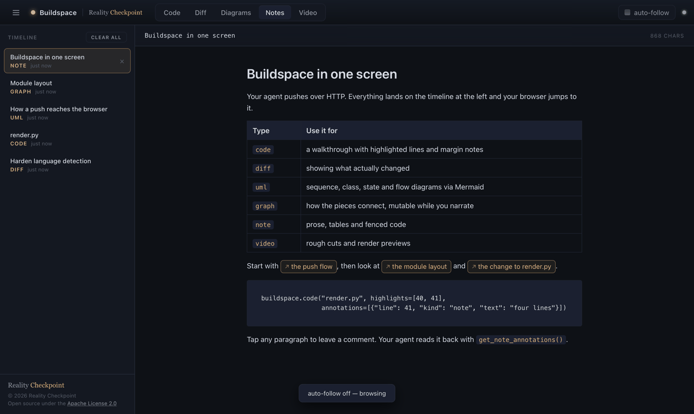
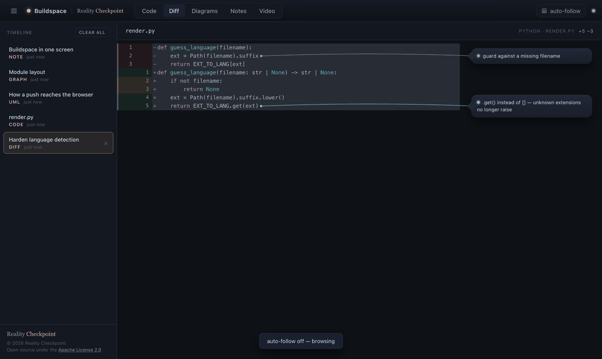
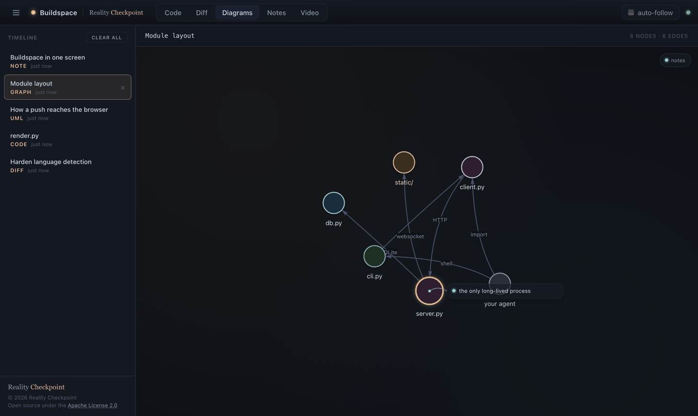
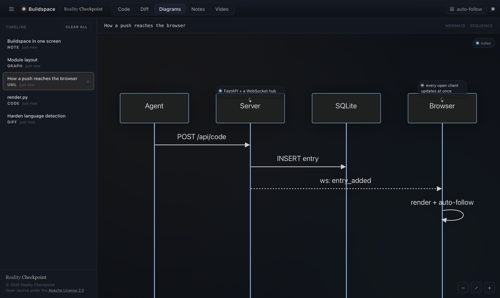
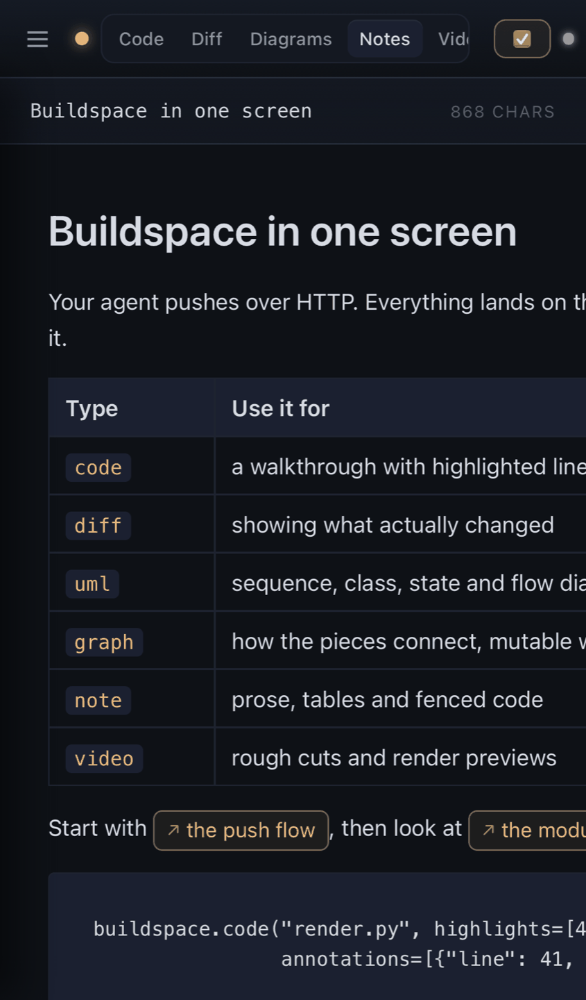

# Buildspace

A local show-and-tell web app for coding agents.

Instead of quoting code, diffs and diagrams into a terminal, an agent
(Claude Code, or any script that can make an HTTP request) pushes them to
Buildspace. They appear instantly in a browser, on a timeline, with
syntax highlighting, margin annotations, live-mutable graphs, Mermaid UML
with remote pan and zoom, markdown notes, and an HTML5 video player. The
page is a PWA, so it works just as well on a phone or tablet as on the
desktop next to the terminal.

Built by [Reality Checkpoint](https://realitycheckpoint.org) for its own
daily work with Claude Code, and released under the Apache License 2.0.



> **Personal use only.** Buildspace has no authentication, and it reads any
> file under `BUILDSPACE_ROOTS` that it is asked for. It is meant to run on
> your own machine or inside a
> private network that already authenticates its members, such as a
> Tailscale tailnet or an SSH tunnel. It is not a secure tool and must not
> be exposed to the public internet. See [SECURITY.md](SECURITY.md).

## What it shows

| Tab | Content type | What you get |
|-----|--------------|--------------|
| Code | `code` | A source file with highlight.js colouring, highlighted lines, and note/warn/ok bubble annotations floating in the margin |
| Diff | `diff` | Two-column before/after with add/remove colouring and the same annotation bubbles on the after side |
| Diagrams | `graph` | Force-directed relationship graph (vis-network). Nodes and edges can be added, removed and highlighted live while you narrate |
| Diagrams | `uml` | Any Mermaid diagram: sequence, class, state, flowchart, ER, gantt, mindmap. Annotations anchor to elements by text match or CSS selector. The agent can pan and zoom the viewer's screen to spotlight an element |
| Notes | `note` | Markdown via marked.js with syntax-highlighted fences. The reader can tap any paragraph, table row or list item and leave a comment that the agent reads back |
| Video | `video` | HTML5 player with HTTP range support and immutable caching. Metadata strip from ffprobe. Collapsible markdown notes under the player |

### Diffs and code, annotated in the margin



### Diagrams, Mermaid or force-directed





### On a phone



Every push lands in a sidebar timeline. Auto-follow is on by default, so the
viewer's screen jumps to each new entry. Navigating manually turns it off.
The agent can force it either way. Notes can link to other entries, so a
prose walkthrough can point at the diagram or diff it is talking about.

## Install

Requires Python 3.10 or newer. `ffprobe` (from ffmpeg) is optional and only
used to read video metadata.

```bash
git clone https://github.com/jivadevoe/reality_checkpoint_buildspace.git
cd reality_checkpoint_buildspace
python3 -m venv venv && source venv/bin/activate
pip install -e .
scripts/run.sh
```

Open http://127.0.0.1:8097. You should see an empty timeline. From another
shell:

```bash
source venv/bin/activate
buildspace code buildspace/server.py -H 20-30 -a "24:this is the request model"
```

### Run at login on macOS

```bash
BUILDSPACE_ROOTS="$HOME/Projects:$HOME/Renders" \
  scripts/install-launchd.sh          # generates and loads a launchd agent
scripts/install-launchd.sh uninstall
```

Set `BUILDSPACE_ROOTS` to the directories you push files from. Without
it, the service can only read files inside this checkout.

After editing the source, restart with:

```bash
launchctl kickstart -k gui/$(id -u)/org.realitycheckpoint.buildspace
```

Note that macOS does not let launchd-managed processes read external or
network volumes. Any file you push by path (code, video, poster) must live
under your home directory or somewhere else the sandbox allows, otherwise
the read fails silently.

### Configuration

All configuration is by environment variable.

| Variable | Default | Meaning |
|----------|---------|---------|
| `BUILDSPACE_HOST` | `127.0.0.1` | Interface the server binds. See Security below before changing it |
| `BUILDSPACE_PORT` | `8097` | TCP port |
| `BUILDSPACE_DB` | `~/.buildspace/buildspace.db` | SQLite file holding the timeline and note comments |
| `BUILDSPACE_ROOTS` | the directory the server starts in (never `$HOME` or `/`) | Colon-separated directories the server may read pushed files from. Paths outside them are refused with 403. Set this for any launchd or service install |
| `BUILDSPACE_MAX_READ_BYTES` | `5242880` (5 MB) | Largest file a code or diff push may name by path |
| `BUILDSPACE_ALLOWED_HOSTS` | empty | Comma-separated extra hostnames the server may be reached as, for example a reverse-proxy or tailnet name. Loopback, IP literals and the machine's own hostname are always allowed |
| `BUILDSPACE_URL` | `http://127.0.0.1:8097` | Where the Python client and CLI send pushes |

## Security

Buildspace is a personal tool for a protected network, not a public
service. [SECURITY.md](SECURITY.md) has the full statement. In short:

- There is no authentication. Anyone who can reach the port can push
  content, delete the timeline, and read the history.
- `POST /api/code`, `POST /api/diff` and `POST /api/video` take a
  filesystem path and the server reads that file. Those reads are confined
  to `BUILDSPACE_ROOTS`, which defaults to the directory the server was
  started from and never to your home directory, and credential and
  personal-data files are refused even inside it. Within the roots,
  though, whoever can reach the API can read what the server process can
  read.
- The default bind is loopback only for that reason. If you want it on a
  phone or a second machine, put it behind something that authenticates,
  such as a Tailscale tailnet or an SSH tunnel. Do not bind to `0.0.0.0` on
  a network you do not fully trust.
- The server refuses requests whose `Host` header is not loopback, an IP
  literal, the machine's own hostname, or a name listed in
  `BUILDSPACE_ALLOWED_HOSTS`. It also refuses WebSocket handshakes and
  mutating requests that carry a browser `Origin` outside that set. This
  stops other web pages you have open from subscribing to your pushes or
  clearing your timeline, including via DNS rebinding. If you reach
  Buildspace through a proxy under a hostname, add that hostname to
  `BUILDSPACE_ALLOWED_HOSTS` or you will get 403s.
- The page loads highlight.js, marked, vis-network, mermaid and panzoom
  from public CDNs, pinned to exact versions. The service worker caches
  them after first load.

## Driving it from Python

`pip install -e .` gives you a `buildspace` module. Every call returns the
created entry as a dict, including its `id`.

```python
import buildspace

buildspace.code("app/server.py", highlights=[12, 13],
                annotations=[{"line": 12, "kind": "warn", "text": "not thread safe"}])

buildspace.diff("app/server.py", before=old_src, after=new_src,
                annotations=[{"line": 40, "kind": "ok", "text": "lock added"}])

buildspace.uml("""sequenceDiagram
    participant Agent
    participant Server
    Agent->>Server: POST /api/code
    Server-->>Agent: entry
""", annotations=[{"text_match": "Server", "text": "FastAPI app"}])
buildspace.zoom_to(text_match="Server", scale=2.5)
buildspace.zoom_reset()

buildspace.graph(nodes=[{"id": "a", "label": "api", "group": "service"},
                        {"id": "db", "label": "sqlite", "group": "db"}],
                 edges=[{"source": "a", "target": "db", "label": "writes"}])
buildspace.add_node("cache", label="redis", group="db")
buildspace.add_edge("a", "cache")
buildspace.highlight(["a"])

entry = buildspace.note("# Summary\nSee " + buildspace.link("the diff", latest="diff"),
                        title="What changed")
buildspace.get_note_annotations(entry)     # comments the reader left on it

buildspace.video("~/renders/cut_v3.mp4", title="Cut v3", notes="- 00:12 audio pop")

buildspace.tab("note")
buildspace.autofollow(False)
buildspace.clear()                          # deletes every entry, immediately
```

Annotation `kind` is one of `note`, `warn` or `ok`. Graph node `group` is
one of `class`, `service`, `interface`, `db` or `external` and controls the
colour.

### Linking between entries

`buildspace.link(label, entry=..., latest=..., title=...)` returns a
markdown link fragment for use inside a note. The three destination forms
are:

| Form | Resolves to |
|------|-------------|
| `#entry-42` | Entry id 42 |
| `#latest:uml` or `#latest:code,diff` | Most recent entry of those kinds |
| `#title:Request%20flow` | First entry whose title contains that substring |

Use the helper rather than hand-writing the fragment. Spaces and brackets
in labels or titles break markdown links in ways that fail silently.

## Driving it from the shell

```bash
buildspace code PATH [-l LANG] [-t TITLE] [-H 10,12-15] [-a "LINE:TEXT" ...]
buildspace diff BEFORE_PATH AFTER_PATH [-t TITLE] [-H ...] [-a ...]
buildspace tab code|diff|graph|note|video
buildspace autofollow on|off
buildspace status        # timeline as JSON
buildspace clear         # deletes everything
```

## HTTP API

Everything the client does is a JSON POST. Any language can drive it.

| Method | Path | Body |
|--------|------|------|
| GET | `/api/history` | Newest-first list of entries |
| GET | `/api/entry/{id}` | One entry with its payload |
| DELETE | `/api/entry/{id}` | Remove one entry |
| POST | `/api/code` | `{path \| content, language?, title?, highlights?, annotations?}` |
| POST | `/api/diff` | `{before, after? \| path, language?, title?, highlights?, annotations?}` |
| POST | `/api/graph` | `{nodes, edges?, title?, highlights?, annotations?}` |
| POST | `/api/graph/patch` | `{add_nodes?, update_nodes?, remove_nodes?, add_edges?, remove_edges?, highlights?, focus?}` applied to the latest graph |
| POST | `/api/uml` | `{mermaid, title?, kind?, annotations?}` |
| POST | `/api/note` | `{markdown, title?}` |
| POST | `/api/video` | `{path, title?, notes?, poster?}` |
| GET | `/media/{id}` | Video bytes with range support |
| GET | `/media/{id}/poster` | Poster image |
| POST | `/api/diagram/focus` | `{mode: selector\|point\|reset, selector?, x?, y?, scale?, padding?}` |
| POST | `/api/tab` | `{tab}` |
| POST | `/api/autofollow` | `{value}` |
| POST | `/api/clear` | Delete every entry |
| POST | `/api/note/annotation` | `{entry_id, block_index, comment, block_preview?, kind?, line_index?}` |
| GET | `/api/note/annotations/{id}` | Comments on a note |
| DELETE | `/api/note/annotation/{id}` | Remove one comment |
| WS | `/ws` | Broadcast channel the page listens on |

Every mutation is broadcast over the WebSocket as a typed message
(`entry_added`, `entry_deleted`, `graph_patch`, `diagram_focus`, `tab`,
`autofollow`, `cleared`, `note_annotation_added`,
`note_annotation_deleted`) so every open browser updates at once.

## Embedding images in notes

The server mounts `buildspace/static/` at `/static/`. Drop an image there
and reference it as `` in a note. The
`.gitignore` excludes everything in that directory except the app shell,
so images you drop there never end up in a commit.

## Using it with Claude Code

`skills/explain/SKILL.md` is a Claude Code skill that teaches the agent
when and how to push to Buildspace. Copy it to `~/.claude/skills/explain/`
and start a new session. From then on, `/explain <thing>` produces an
annotated walkthrough in the browser instead of a wall of text in the
terminal.

## Layout

```
buildspace/
  server.py      FastAPI app, HTTP + WebSocket API, video streaming
  client.py      Python client used by the CLI and by agents
  cli.py         `buildspace` command
  db.py          SQLite: entries and note annotations
  diff.py        Line diff used by /api/diff
  render.py      File reading and language detection
  static/        index.html, app.js, app.css, sw.js, manifest, icons
scripts/
  run.sh                 Start the server
  install-launchd.sh     macOS login agent
skills/explain/          Claude Code skill
AGENTS.md                Setup and usage brief for coding agents
SECURITY.md              Threat model and personal-use-only statement
NOTICE                   Apache attribution notice
docs/img/                README screenshots
```

## License

Apache License 2.0. Copyright 2026 Reality Checkpoint. See `LICENSE` and `NOTICE`.
